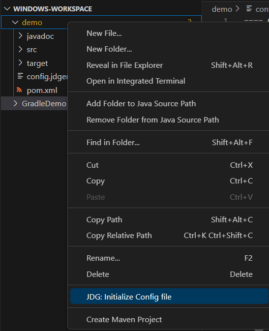
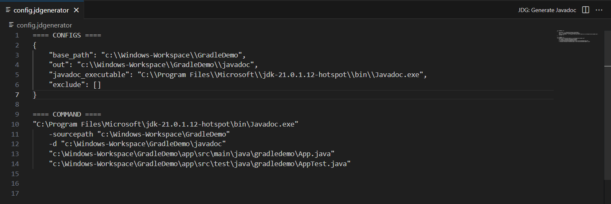
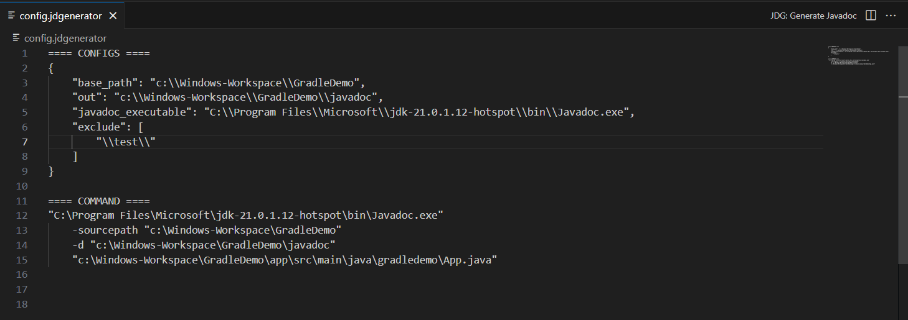

# javadoc Generator

Javadoc Generator is an extension to VSCode that wraps the commandline javadoc compiler. I wrote this in highschool and was originally created to fill my own needs for quickly creating a javadoc. But after over 25k downloads, I decided to rebuild this extension with better error reporting and transparent configuration.  

## Usage
You will first need a JDG Config file. You can get one by clicking on your project folder and clicking "JDG: Initialize Config file". 

Adjust the config file until a valid command is generated with no errors. 

You can exclude folders in the specified base_path by adding to the exclude array. This array matches strings directly, using the string prototype's includes() method.

Once a valid javadoc command is created, click the button in the top right corner labled "JDG: Generate Javadoc". 

Once the Javadoc generation is complete, you should see the output appended to the config file. 

## Issues
If you find issues, and you probably will, you can report them [here](https://github.com/KeeganBruer/javadoc-generator/issues).
Please include the config.jdgenerator file with your issue report.

## Release Notes

### 3.0.5
- "raw_params" config added from issue #31

### 3.0.2 - 3.0.4
- switches to JSON for more complex configuration
- adds exclude array as requested by issue #28
- Readme updates

### 3.0.0
- Complete rebuild
- Adds config.jdgenerator for better transparency
- Config validation and error reporting
- Shows the generated Javadoc command in the config.jdgenerator
- Appends Javadoc output to config file for easy submission to [GitHub Issues](https://github.com/KeeganBruer/javadoc-generator/issues)
